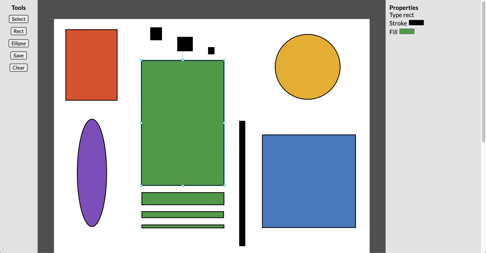

# MagicDraw
Personal project built in two days using React to explore drawing and editing shapes using HTML Canvas with React.

>Deployed app at: https://magic-draw.herokuapp.com/
# Table of Contents

 - [Technology Used](#technology-used)

 - [Requirements](#requirements)

 - [Installation](#installation)

## Technology Used

### Front End
- React
- Konva
- Halka State
- Immer
- Webpack
- Babel

### Back End
- Node.js
- Express

## Requirements
- Node v 14.0.0 or later

## Installation
CLone the repo to your computer, using the terminal navigate to the root folder amd execute the command:

      npm install

Next build the bundle by executing the command:

      npm run build

Start the server using the command:

      npm start

You can now open your browser and go to http://localhost:8080 and try drawing some shapes.

Enjoy!
